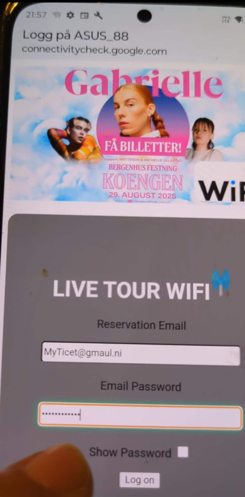

# Temporary_repo !
# Emai & password phishing templates to replace with the deafult content in /ag1/www/ when evil twin attack is running.
- The https_plugin is used in the images, but not needed.
- Only hackers mind limited way of use. QR code was used to test "consert" [ image below ]
- Whiteout https-plugin templates still capture credentials & avoid check.php & update.php as those files would interrupt the code used.
- If not sure how to replace files in ag1/www,See video below to get an idé.
  The method start at minute ~13.00. Other stuff in video is very different & only for AP password.
 The ag1/www folder must bee open as root to replace the files.
- Email validation, confirme password etc is done in portal.js so coustuming templates for other targets is a very easy task.
- Email & password typed will popup in txt file at /home/kali/Desktop by default.
- Images example shows how templates look for victim, when use https_plugin
- If any question hit mee up on Dicord, or use email found at repos_overview.
-    

 - How to replace file in ag1/www by Fr4nk Solo in Spanish language.
- https://www.youtube.com/watch?v=fbmnzlNBIE0

  

(<a href="#top" >Back To Top</a>)

